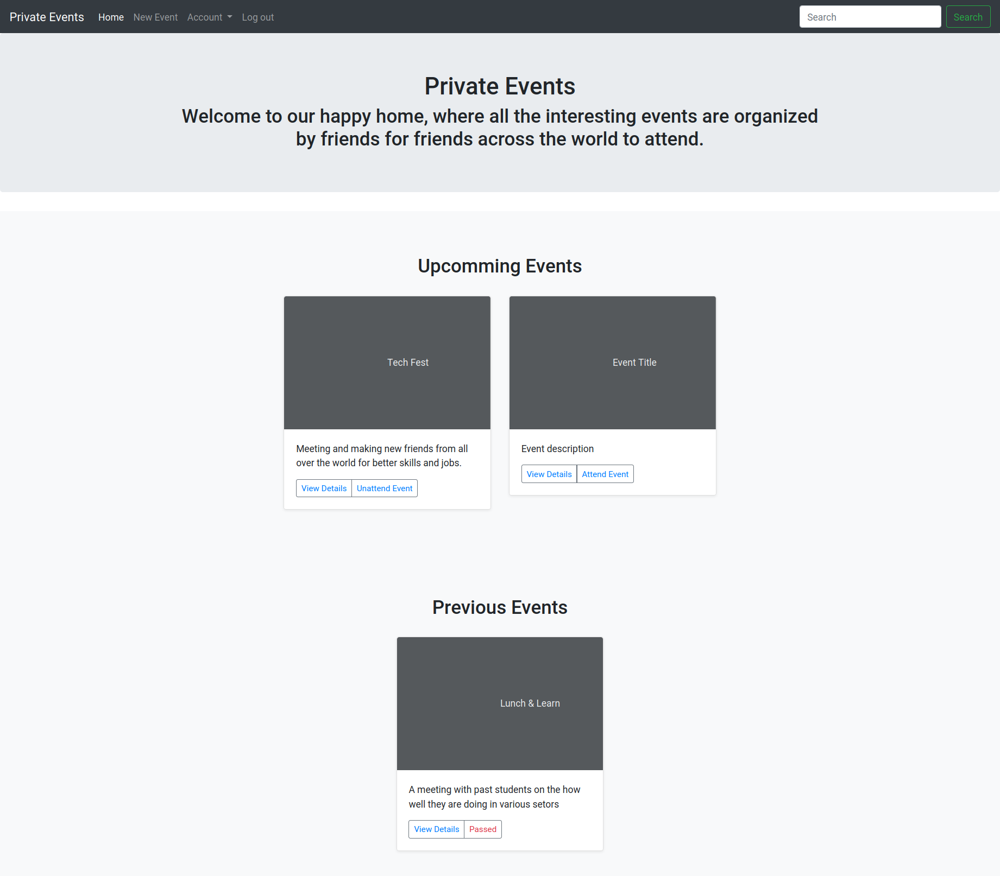

<h3 align="center">Private Events</h3>

<h4 align="center">
  🛸 Stay hungry, stay foolish
</h4>

<div align="center">
    
[](https://github.com/JelilFaisalAbudu/private-events1)
[](https://github.com/JelilFaisalAbudu/private-events1/commits/)
[](/LICENSE)
[](https://github.com/JelilFAisalAbudu/private-events1/issues)
[](https://github.com/JelilFaisalAbudu)
[](https://twitter.com/jelilabudu)
</div>

<p align="center">
<a href="#about">About</a>&nbsp;&nbsp;&nbsp;|&nbsp;&nbsp;&nbsp;
<a href="#installing">Installing</a>&nbsp;&nbsp;&nbsp;|&nbsp;&nbsp;&nbsp;
<a href="#built_using">Built with</a>&nbsp;&nbsp;&nbsp;|&nbsp;&nbsp;&nbsp;
<a href="#author">Author</a>
</p>

<p align="center">
  <a href="" rel="noopener">
  
  </a>
</p>

## 🧐 About <a name = "about"></a>
<h3 align="center">This is a Private Events project, which users can log in, create and attend to events. The goal here is to learn how associations works and how to implement many-to-many; belonging and so on. Hope you guys enjoy it.

## ✨ Features

☑ Login with email

☑ Create events

☑ Attend to events

☑ Tested with Rspec and Capybara

☑ Valid HTML5 & CSS3

## 👷‍♂️ ‍Installing <a name= "installing"></a>

```bash
Cloning:
git clone https://github.com/kevincappuccino/private-events
```

Downloading:

- unzip the downloaded file
Get into the page using your favorite terminal and run the following commands:

```bash
bundle install
rails db:migrate
rails s
```

Then access in your favorite browser the indicated port number (By default rails uses: `localhost:3000`)

## 🔧 Built with<a name = "built_using"></a>

- [Ruby on Rails](https://rubyonrails.org/) - A web-application framework that includes everything needed to create database-backed web applications according to the Model-View-Controller (MVC) pattern.
- [Bootstrap 4](https://getbootstrap.com/docs/4.3/getting-started/introduction/) - Front-end component library
- [Sass](https://sass-lang.com/documentation) - CSS extension language
- [Capybara](https://github.com/teamcapybara/capybara) - Acceptance test framework for web applications 
- [Rspec](https://rspec.info/) - JBehaviour Driven Development for Ruby. Making TDD Productive and Fun.
- [Bootsnipp](https://bootsnipp.com/) - Design elements, playground and code snippets for Bootstrap HTML/CSS/JS framework 
- [PhotoShop CC](https://adobe.com/) - The most powerfull photo editor ever made;

## ✒️  Autor <a name = "author"></a>

👤 **Jelil Faisal Abudu**

- Github: [JelilFaisalAbudu](https://github.com/JelilFaisalAbudu/)
- Twitter: [@jelilabudu](https://twitter.com/jelilabudu)
- Linkedin: [jelilfaisalabudu](linkedin.com/in/jelilfaisalabudu)

## 🤝 Contributing

Contributions, issues, and feature requests are welcome!

Feel free to check the [issues page](https://github.com/JelilFaisalAbudu/private-events1/issues).

## 👍 Show your support

Give a ⭐️ if you like this project!

## 🏆 Acknowledgement

- [Rails documentation](https://guides.rubyonrails.org/)

## 📝 License

This project is free to use as learning purposes. For any external content (e.g. logo, images, ...), please contact the proper author and check their license of use.
